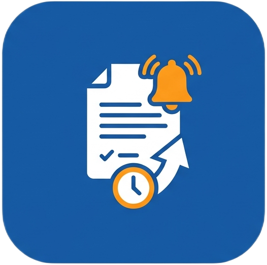

# ContractEnd

<p align="center">
  
</p>

<p align="center">
  Applicazione desktop Windows per la gestione delle scadenze dei contratti.
</p>

---

# 🇮🇹 Italiano

## 📋 Descrizione

**ContractEnd** è un'applicazione desktop sviluppata con **Flutter e Dart** per la gestione di clienti, contratti e relative scadenze.

Il progetto nasce con l'obiettivo di realizzare uno strumento semplice e intuitivo per tenere sotto controllo i contratti in scadenza e, in futuro, automatizzare la gestione delle notifiche.

## ✨ Funzionalità

* 📊 Dashboard con riepilogo delle informazioni principali
* 👥 Gestione dei clienti
* 📄 Gestione dei contratti
* 📅 Gestione delle date di inizio e scadenza
* ⚠️ Indicazione dello stato del contratto
* 🔎 Ricerca di clienti e contratti
* 📝 Inserimento e modifica dei dati
* 🗑️ Eliminazione dei dati
* 📎 Associazione di documenti PDF ai contratti
* ✅ Validazione dei dati inseriti
* 🖥️ Interfaccia desktop Windows
* 🎨 Icona personalizzata dell'applicazione

## 🛠️ Tecnologie

* **Flutter**
* **Dart**
* **Material 3**
* **file_picker**
* **Git / GitHub**

## 💻 Piattaforma

Attualmente l'applicazione è sviluppata per:

* Windows 10
* Windows 11

## 📁 Struttura del progetto

```text
lib/
├── main.dart
├── screens/
│   ├── dashboard/
│   │   └── dashboard_screen.dart
│   ├── clients/
│   │   ├── clients_screen.dart
│   │   └── client_form_dialog.dart
│   └── contracts/
│       ├── contracts_screen.dart
│       └── contract_form_dialog.dart
└── widgets/
    ├── app_sidebar.dart
    └── stat_card.dart

assets/
└── icons/
    └── icon_master.png
```

## 🚧 Roadmap

### Completato

* [x] Dashboard
* [x] Interfaccia gestione clienti
* [x] Interfaccia gestione contratti
* [x] Ricerca clienti e contratti
* [x] Validazione dei form
* [x] Selezione dei documenti PDF
* [x] Indicazione dello stato dei contratti
* [x] Widget testing
* [x] Icona personalizzata Windows
* [x] Icona personalizzata nell'interfaccia

### In sviluppo

* [ ] Database SQLite
* [ ] Salvataggio persistente dei clienti
* [ ] Salvataggio persistente dei contratti
* [ ] Statistiche reali nella dashboard
* [ ] Notifiche native Windows
* [ ] Notifiche automatiche per le scadenze
* [ ] Storico delle notifiche
* [ ] Impostazioni dell'applicazione
* [ ] Gestione migliorata dei documenti

## 🎯 Obiettivi del progetto

Il progetto è sviluppato con particolare attenzione a:

* semplicità di utilizzo
* organizzazione del codice
* separazione delle responsabilità
* validazione dei dati
* gestione locale delle informazioni
* futura automazione delle notifiche
* sviluppo di un'applicazione desktop completa per Windows

## 📌 Stato del progetto

**In sviluppo**

Il progetto è attualmente nella fase di sviluppo dell'interfaccia e delle funzionalità di base. Le prossime fasi saranno dedicate alla persistenza dei dati tramite SQLite e al sistema di notifiche Windows.

## 📄 Licenza

Progetto personale sviluppato a scopo di studio, sperimentazione e portfolio.

---

# 🇬🇧 English

## 📋 Description

**ContractEnd** is a desktop application developed with **Flutter and Dart** for managing clients, contracts, and contract expiration dates.

The project aims to provide a simple and intuitive tool for keeping track of expiring contracts and, in future versions, automating the notification system.

## ✨ Features

* 📊 Dashboard with key information overview
* 👥 Client management
* 📄 Contract management
* 📅 Contract start and expiration dates
* ⚠️ Contract status tracking
* 🔎 Client and contract search
* 📝 Data creation and editing
* 🗑️ Data deletion
* 📎 PDF document attachment to contracts
* ✅ Form validation
* 🖥️ Windows desktop interface
* 🎨 Custom application icon

## 🛠️ Technologies

* **Flutter**
* **Dart**
* **Material 3**
* **file_picker**
* **Git / GitHub**

## 💻 Platform

The application is currently developed for:

* Windows 10
* Windows 11

## 📁 Project Structure

```text
lib/
├── main.dart
├── screens/
│   ├── dashboard/
│   │   └── dashboard_screen.dart
│   ├── clients/
│   │   ├── clients_screen.dart
│   │   └── client_form_dialog.dart
│   └── contracts/
│       ├── contracts_screen.dart
│       └── contract_form_dialog.dart
└── widgets/
    ├── app_sidebar.dart
    └── stat_card.dart

assets/
└── icons/
    └── icon_master.png
```

## 🚧 Roadmap

### Completed

* [x] Dashboard
* [x] Client management interface
* [x] Contract management interface
* [x] Client and contract search
* [x] Form validation
* [x] PDF document selection
* [x] Contract status tracking
* [x] Widget testing
* [x] Custom Windows application icon
* [x] Custom application icon in the interface

### In Development

* [ ] SQLite database
* [ ] Persistent client storage
* [ ] Persistent contract storage
* [ ] Real dashboard statistics
* [ ] Native Windows notifications
* [ ] Automatic contract expiration notifications
* [ ] Notification history
* [ ] Application settings
* [ ] Improved document management

## 🎯 Project Goals

The project focuses on:

* ease of use
* clean code organization
* separation of responsibilities
* data validation
* local data management
* future notification automation
* building a complete Windows desktop application

## 📌 Project Status

**In development**

The project is currently in the interface and core functionality development phase. The next stages will focus on SQLite data persistence and the Windows notification system.

## 📄 License

Personal project developed for learning, experimentation, and portfolio purposes.
